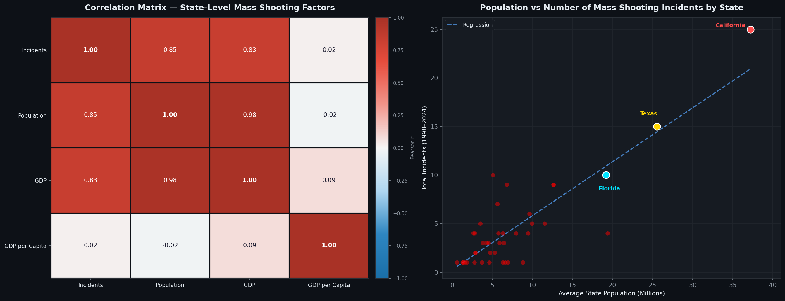

# การกราดยิงในสหรัฐอเมริกา: 60 ปีแห่งวิกฤตที่ทวีความรุนแรง

> *"Mass shootings are a uniquely American problem."*
> — [Brady United, Gun Violence Statistics](https://www.bradyunited.org/resources/statistics)

---

## 📌 บทนำ

> **โดยเฉลี่ยแล้ว เหตุการณ์กราดยิงเกิดขึ้นทุก 86 วันในสหรัฐอเมริกา และในช่วงทศวรรษที่ผ่านมา (2015–2025) ตัวเลขนี้เพิ่มขึ้นเป็นทุก 34 วัน**

การวิเคราะห์นี้ใช้ข้อมูลการกราดยิง 254 เหตุการณ์ ระหว่างปี 1966–2026 จาก [Mother Jones](https://www.motherjones.com/politics/2012/12/mass-shootings-mother-jones-full-data/)  และ [The Violence Project](https://www.theviolenceproject.org/) เพื่อชี้ให้เห็นว่า การกราดยิงในสหรัฐอเมริกา มีสาเหตุหลักมาจากระบบที่ล้มเหลวใน 3 จุดเดิม คือ การเข้าถึงอาวุธ ปัญหาด้านสุขภาพจิต และการตอบสนองของสังคม 

---

## 📈 แนวโน้มเหตุการณ์: วิกฤตที่เร่งตัวขึ้น
    
Fig 1: จำนวนเหตุการณ์กราดยิงต่อปี — ความถี่เพิ่มขึ้นอย่างรวดเร็วหลังปี 2010

**ทำไมถึงเพิ่มขึ้นหลังปี 2010?**

ก่อนปี 2010 สหรัฐฯ มีเหตุการณ์เฉลี่ย 2.7 ครั้ง/ปี หลังปี 2010 ตัวเลขนี้พุ่งขึ้นเป็น 8.4 ครั้ง/ปี — เพิ่มขึ้น 3.1 เท่า ในเวลาเพียง 10 ปี ซึ่งสาเหตุหลักอย่างหนึ่งเกิดจากการเติบโตของโซเชียลมีเดียและการรับรู้ข่าวสารที่ง่ายขึ้น โดยข้อมูลจาก NIJ (National Institute of Justice, 2022) พบว่ามีผู้ก่อเหตุ **21.6% ที่ศึกษาการกราดยิงในอดีต** ก่อนจะลงมือก่อเหตุ เเละ งานวิจัยของ Towers et al. (2015) ในวารสาร PLOS ONE ยังพบอีกว่าการกราดยิงมี Contagion Effect หรือ ปรากฏการณ์การแพร่ระบาด กล่าวคือเมื่อเกิดเหตุการณ์ขึ้นครั้งหนึ่ง โอกาสที่จะเกิดเหตุซ้ำในช่วงเวลาสั้นๆถัดมาจะสูงขึ้นอย่างมีนัยสำคัญ ดังนั้นการเข้าถึงโซเชียลมีเดียและการรับรู้ข่าวสารที่ง่ายขึ้นจึงเป็นอีกสาเหตุหนึ่งที่ทำให้ความถี่ของเหตุการณ์เพิ่มสูงขึ้น

---

Fig 2: จำนวนผู้เสียชีวิตและบาดเจ็บรายปี (ไม่รวมเหตุการณ์สังหารหมู่ในลาสเวกัส ปี 2017)

นอกจากความถี่ที่เพิ่มขึ้นใน Fig 1 แล้ว กราฟนี้แสดงให้เห็นว่า **จำนวนผู้เสียชีวิตและบาดเจ็บก็เพิ่มขึ้นในทิศทางเดียวกัน** — วิกฤตนี้ไม่ได้แค่เกิดบ่อยขึ้น แต่รุนแรงขึ้นด้วย

> **หมายเหตุ:** เหตุการณ์ Las Vegas Strip 2017 ถูกตัดออกเนื่องจากเป็น outlier ทางสถิติที่รุนแรงผิดปกติ (มือปืนเพียงคนเดียวยิงใส่ฝูงชน 22,000 คน) หากรวมไว้จะบดบัง trend ของปีอื่นๆ

- 💀 ผู้เสียชีวิตเฉลี่ยเพิ่มจาก **17.0 ราย/ปี** (ก่อนปี 2010) เป็น **54.6 ราย/ปี** (หลังปี 2010)
- 🤕 ผู้บาดเจ็บเฉลี่ยเพิ่มจาก **15.1 ราย/ปี** (ก่อนปี 2010) เป็น **53.1 ราย/ปี** (หลังปี 2010)

---

## 🗺️ สถานการณ์กราดยิงในเเต่ละรัฐ

Fig 4a: แคลิฟอร์เนียเป็นรัฐที่มีจำนวนการเกิดเหตุการณ์กราดยิงสูงที่สุด (37) ตามด้วยเท็กซัส (25) และฟลอริดา (16)

Fig 4b: Correlation Matrix (ซ้าย) และ Population vs Incidents Scatter Plot (ขวา)

**ทำไมแคลิฟอร์เนีย เท็กซัส และฟลอริดาถึงมีการก่อเหตุบ่อยครั้ง?**

เรานำข้อมูลประชากรและ GDP รายรัฐจาก US Census Bureau (2020) และ Bureau of Economic Analysis (2020) มาวิเคราะห์ร่วมกับข้อมูลการกราดยิงในช่วงปี 1998–2024 จากการวิเคราะห์ความสัมพันธ์ระหว่างตัวแปรระดับรัฐ พบประเด็นสำคัญ 2 จุด:

- **ประชากร → จำนวนเหตุการณ์ (r = 0.85)** — ขนาดประชากรของรัฐนั้นๆคือตัวแปรหลักที่ทำให้จำนวนครั้งในการก่อเหตุเพิ่มสูงขึ้น
- **GDP ต่อหัว → จำนวนเหตุการณ์ (r = 0.02)** — GDP ต่อหัวบ่งบอกว่าความร่ำรวยของคนในรัฐไม่ได้ทำให้จำนวนครั้งในการก่อเหตุลดลงเลย

จากข้อมูลเราจะพบว่าขนาดประชากรคือตัวแปรสำคัญที่ทำให้จำนวนครั้งในการก่อเหตุเพิ่มสูงขึ้นซึ่งสอดคล้องกับข้อมูลใน Fig 4a เราอาจใช้ข้อมูลนี้ในการประกอบการตัดสินใจในการกำหนดหรือปรับปรุงกฎหมายในการครอบครองอาวุธของเเต่ละรัฐให้เหมาะสมขึ้นได้

---

## 📍 สถานที่ที่เกิดเหตุกราดยิงบ่อยครั้ง

Fig 5: สถานที่ทำงานเป็นจุดที่พบบ่อยที่สุด (57) รองลงมาคือโรงเรียน (31)

**ทำไมสถานที่ทำงานและโรงเรียนถึงเป็นเป้าหมายบ่อยที่สุด?**

สถานที่ทำงาน เป็นจุดที่พบว่ามีเหตุการณ์กราดยิงเกิดขึ้นบ่อยครั้ง สาเหตุหลักเเป็นเพราะที่ทำงานเป็นจุดที่รวม ความขัดแย้งระหว่างบุคคล ความเครียดทางการเงิน ความคับแค้นจากการถูกเลิกจ้างหรือลดตำแหน่ง รวมถึงผู้ก่อเหตุมีความคุ้นเคยกับสถานที่เป็นอย่างดี โดย The Violence Project พบว่า 70% ของเหตุการณ์กราดยิงในที่ทำงานมีแรงจูงใจจากปัญหาการจ้างงาน เช่น การถูกไล่ออก (Peterson & Densley, 2022)
อันดับที่รองลงมาคือ โรงเรียน แต่อาจจะมีเหตุผลที่แตกต่างจากสถานที่ทำงาน คือ — โรงเรียนถูกมองว่าเป็น เป้าหมายที่อ่อนแอ ที่มีตารางเวลาที่คาดเดาได้และการรักษาความปลอดภัยที่ไม่สูงนัก นอกจากนี้ผู้ก่อเหตุในโรงเรียนมักมีความคับแค้นจาก bullying และการถูกกีดกันทางสังคม (NIJ, 2022) และข่าวการกราดยิงในโรงเรียนได้รับความสนใจจากสื่อค่อนข้างมาก ซึ่งอาจเชื่อมโยงไปสู่พฤติกรรมเลียนแบบ (Towers et al., 2015)
จุดที่น่าสังเกตคือแม้ว่าโรงเรียนจะอยู่อันดับ 2 ในแง่ ความถี่ แต่มีอัตราผู้เสียชีวิตเฉลี่ยต่อเหตุการณ์สูงกว่าสถานที่ทำงาน (9.1 คน/เหตุการณ์ เทียบกับ 6.0 คนสำหรับสถานที่ทำงาน)

---

## 🔫 โปรไฟล์ของผู้ก่อเหตุ

Fig 6: 97.6% ของผู้ก่อเหตุเป็นเพศชาย (248 ราย) เเละ ผู้ก่อเหตุผิวขาวคิดเป็น 53.5% ของเหตุการณ์ทั้งหมด

**ทำไมผู้ก่อเหตุเกือบทั้งหมดถึงเป็นเพศชาย?**

คำอธิบายหลักในเรื่องนี้อาจจะอยู่ที่ ความเป็นชายที่ถูกสังคมกำหนด — เมื่อผู้ชายประสบกับความอัปยศ การถูกปฏิเสธ หรือความล้มเหลว การกราดยิงอาจจะกลายเป็นการกระทำหนึ่งที่ทำให้ผู้ก่อเหตุรู้สึกว่าได้กู้คืนอำนาจกลับคืนมา (Kalish & Kimmel, 2010; Madfis, 2014)

Fig 7: อายุของผู้ก่อเหตุอยู่ระหว่าง 11–72 ปี โดยมีค่าเฉลี่ยอยู่ที่ 33 ปี เเละมีผู้ก่อเหตุที่มีอายุต่ำกว่า 18 ปีมากถึง 11 ราย (4.3%) — ทุกรายเกิดขึ้นในโรงเรียน

อีกจุดหนึ่งที่ค่อนข้างน่าตกใจคือ มีผู้ก่อเหตุมากถึง 11 รายที่ยังเป็นผู้เยาว์ ซึ่งทุกคนครอบครองปืนอย่างผิดกฏหมายเเละมักจะขโมยอาวุธมาจากสมาชิกในครอบครัว (NIJ, 2022) 
จากข้อมูลยังพบอีกว่า 63.6% ของผู้ก่อเหตุกลุ่มนี้มีสัญญาณปัญหาสุขภาพจิตก่อนเกิดเหตุ ข้อมูลเหล่านี้ชี้ให้เห็นว่า การแทรกแซงตั้งแต่เนิ่นๆ อาจสามารถยับยั้งเหตุการณ์บางส่วนได้ เนื่องจากผู้เยาว์ยังอยู่ในระบบโรงเรียนที่มีบุคลากรติดต่อกับพวกเขาทุกวัน 

---

## 🔧 อาวุธที่ใช้

Fig 8: ปืนพกเป็นอาวุธที่ใช้บ่อยที่สุด (210 เหตุการณ์) รองลงมาคือปืนไรเฟิล (149) เเละผู้ก่อเหตุส่วนใหญ่มักใช้อาวุธมากกว่าหนึ่งประเภท

**ทำไมปืนพกถึงเป็นอาวุธที่พบบ่อยที่สุด?**

จากข้อมูลจะพบว่า อาวุธที่ผู้ก่อเหตุมักเลือกใช้คือ ปืนพก เเละ ปืนไรเฟิล ซึ่งสอดคล้องกับงานวิจัยที่พบว่า อาชญากรส่วนใหญ่เลือกอาวุธโดยพิจารณาจากความสามารถในการซุกซ่อนและอำนาจการยิง (Silva, J.A., & Capellan, J.A. (2019) ปืนพกเป็นอาวุธปืนที่ **หาและซุกซ่อนได้ง่าย** สามารถซื้อได้อย่างถูกกฎหมายในรัฐส่วนใหญ่ ปืนไรเฟิลมี **ประสิทธิภาพเเละพลังทำลาย** เนื่องจากอัตราการยิงที่รวดเร็วและพลังงานกระสุนที่สูง (Klarevas et al., 2021) โดยเหตุการณ์ที่ใช้ปืนไรเฟิลมีจำนวนเหยื่อเฉลี่ยสูงกว่าเหตุการณ์ที่ใช้ปืนพกเพียงอย่างเดียวถึง 1.8 เท่า

---

## 🧠 แรงจูงใจ

Fig 10: ความคับแค้นในที่ทำงาน/การเงิน และความขัดแย้งในครอบครัวเป็นแรงจูงใจหลักสองอย่างที่ระบุได้ชัดเจนที่สุด ไม่รวมหมวด "อื่นๆ/ไม่ระบุ" เพื่อความชัดเจน

แรงจูงใจที่พบมากที่สุด มักเกิดจากความขัดแย้งในที่ทำงาน เช่น การถูกไล่ออก การถูกปฏิบัติอย่างไม่เป็นธรรม หรือปัญหาทางการเงินสะสม งานวิจัยพบว่าผู้ก่อเหตุมักมีประวัติ "grievance collector" คือการสะสมความโกรธแค้นต่อนายจ้างหรือเพื่อนร่วมงานมาเป็นเวลานานก่อนลงมือ (FBI, 2019 – A Study of the Pre-Attack Behaviors of Active Shooters) อันดับที่รองลงมาคือ ความขัดแย้งในครอบครัวหรือความรุนแรงในครอบครัวที่บานปลาย งานวิจัยชี้ว่าเหตุกราดยิงจำนวนมากเริ่มต้นจาก domestic violence ก่อนขยายไปสู่เหยื่อรายอื่น
เเม้ว่าอันดับที่สามจะเกี่ยวข้องความผิดปกติทางจิตที่ไม่ได้รับการรักษา อย่างไรก็ตาม เราไม่ควรเหมารวมว่าความเจ็บป่วยทางจิตเป็นสาเหตุหลัก เพราะคนส่วนใหญ่ที่มีปัญหาสุขภาพจิตไม่ได้ก่อความรุนแรง(American Psychological Association, 2013)

---

## 📊 สรุป

โปรเจกต์นี้วิเคราะห์เหตุการณ์กราดยิงในสหรัฐอเมริกา **254 เหตุการณ์** ระหว่างปี 1966–2026 ผ่านมุมมองในด้าน แนวโน้มเวลา ภูมิศาสตร์ โปรไฟล์ผู้ก่อเหตุ อาวุธ และแรงจูงใจ เพื่อทดสอบสมมติฐานว่า **"การกราดยิงเป็นผลลัพธ์ที่เกิดจากระบบที่ล้มเหลว 3 จุดเดิม"** คือ

**ระบบการเข้าถึงอาวุธล้มเหลว** — 63.4% ของผู้ก่อเหตุได้อาวุธมาถูกกฎหมาย ผ่าน background check แล้ว แต่ยังก่อเหตุได้ เพราะระบบปัจจุบันยังไม่ครอบคลุมบันทึกสุขภาพจิตและไม่มีระยะเวลารอในหลายรัฐ

**ระบบตรวจจับปัญหาด้านสุขภาพจิตล้มเหลว** — 69.7% มีสัญญาณปัญหาสุขภาพจิตก่อนเกิดเหตุการณ์ แต่ไม่ได้มีระบบที่ช่วยป้องกัน หรือ การเข้าแทรกแซง ปัญหานี้ที่ดีพอ โดยเฉพาะ โรงเรียน ที่สามารถให้ ความรู้ การป้องกัน หรือเเทรกเเซงได้ตั้งเเต่เนิ่นๆ  

**ระบบตอบสนองของสังคมล้มเหลว** — สื่อมีการนำเสนอเเละให้รายละเอียดของผู้ก่อเหตุมากเกินไป เมื่อรวมกับการเติบโตของโซเชียลมีเดียและการรับรู้ข่าวสารที่ง่ายขึ้น ส่งผลให้เกิด Contagion Effect ที่กระตุ้นให้เกิดพฤติกรรมเลียนแบบมากขึ้น

---

## แหล่งข้อมูล

**ชุดข้อมูลหลัก:**
- Follman, M., et al. (2024). *US Mass Shootings Database*. Mother Jones. https://www.motherjones.com/politics/2012/12/mass-shootings-mother-jones-full-data/
- Peterson, J., & Densley, J. (2024). *The Violence Project Database*. https://www.theviolenceproject.org/databases/

**ข้อมูลประชากรและเศรษฐกิจ:**
- US Census Bureau. (2020). *2020 Census: State Population Totals*. https://www.census.gov/data/tables/time-series/demo/popest/2020s-state-total.html
- Bureau of Economic Analysis. (2020). *GDP by State*. https://www.bea.gov/data/gdp/gdp-state
- Kaggle. (n.d.). *Historical State Populations (1900–2017)*. https://www.kaggle.com/datasets/hassenmorad/historical-state-populations-19002017
- Federal Reserve Bank of St. Louis. (n.d.). *State Population Data (FRED)*. https://fred.stlouisfed.org/release/tables?rid=118&eid=259194&od=1900-01-01#

**งานวิจัยอ้างอิง:**
- Towers, S., et al. (2015). Contagion in Mass Killings and School Shootings. *PLOS ONE*, 10(7). https://doi.org/10.1371/journal.pone.0117259
- National Institute of Justice. (2022). Public Mass Shootings: Database Amasses Details of a Half Century of U.S. Mass Shootings. https://nij.ojp.gov/topics/articles/public-mass-shootings-database-amasses-details-half-century-us-mass-shootings
- Johnston, J.B., & Joy, A. (2016). Mass Shooters and the Media Contagion Effect. *American Psychological Association Annual Convention*.
- Kalish, R., & Kimmel, M. (2010). Suicide by Mass Murder: Masculinity, Aggrieved Entitlement, and Rampage School Shootings. Health Sociology Review, 19(4).
- Madfis, E. (2014). Triple Entitlement and Homicidal Anger: An Exploration of the Intersectional Identities of American Mass Murderers. Men and Masculinities, 17(1), 67–86.
- Silva, J.A., & Capellan, J.A. (2019). Firearm acquisition patterns and characteristics of California mass and active shooters. Journal of Criminal Justice. https://doi.org/10.1016/j.jcrimjus.2023.102046
- Klarevas, L., et al. (2021). Impact of Firearm Surveillance on Gun Control Policy: Regression Discontinuity Analysis. JMIR Public Health and Surveillance. https://pmc.ncbi.nlm.nih.gov/articles/PMC8103291/
- Everytown for Gun Safety (2023). Mass Shootings in America. https://everytownresearch.org/maps/mass-shootings-in-america/
- Metzl, J. M., & MacLeish, K. T. (2015). Mental illness, mass shootings, and the politics of American firearms. American Journal of Public Health, 105(2), 240–249. https://doi.org/10.2105/AJPH.2014.302242
- FBI (2019). A Study of the Pre-Attack Behaviors of Active Shooters in the United States Between 2000 and 2013. U.S. Department of Justice. https://www.safety.pitt.edu/sites/default/files/pre-attack-behaviors-of-active-shooters-in-us-2000-2013-2_2.pdf
---
