# การกราดยิงในสหรัฐอเมริกา: 60 ปีแห่งวิกฤตที่ทวีความรุนแรง

> *"Mass shootings are a uniquely American problem."*
> — [Brady United, Gun Violence Statistics](https://www.bradyunited.org/resources/statistics)

---

## 📌 บทนำ

> **โดยเฉลี่ยแล้ว เหตุการณ์กราดยิงเกิดขึ้นทุก 86 วันในสหรัฐอเมริกา และในช่วงทศวรรษที่ผ่านมา (2015–2025) ตัวเลขนี้เพิ่มขึ้นเป็นทุก 34 วัน**

โครงการนี้สำรวจรูปแบบ แนวโน้ม และข้อมูลเชิงลึกจากชุดข้อมูลการกราดยิงหมู่ในสหรัฐอเมริกา **254 เหตุการณ์** ระหว่างปี 1966–2026 โดยอ้างอิงข้อมูลจาก [Mother Jones](https://www.motherjones.com/politics/2012/12/mass-shootings-mother-jones-full-data/) และ [The Violence Project](https://www.theviolenceproject.org/)

เป้าหมายคือการทำความเข้าใจว่าเหตุการณ์เหล่านี้เปลี่ยนแปลงไปอย่างไรตามกาลเวลา เกิดขึ้นที่ไหน รุนแรงแค่ไหน และใครเป็นผู้ก่อเหตุ

---

## 📈 แนวโน้มเหตุการณ์: 1966–2026

Fig 1: จำนวนเหตุการณ์กราดยิงต่อปี — ความถี่เพิ่มขึ้นอย่างรวดเร็วหลังปี 2010

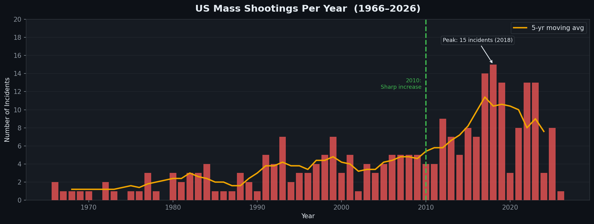

**ทำไมถึงเพิ่มขึ้นหลังปี 2010?**

สหรัฐอเมริกามีเหตุการณ์เฉลี่ย 2.7 ครั้ง/ปี หลังปี 2010 ตัวเลขนี้พุ่งขึ้นเป็น 8.4 ครั้ง/ปี (เพิ่มขึ้นถึง 3 เท่า) ซึ่งเกิดจากปัจจัยหลายอย่าง ได้แก่ การเติบโตของ social media ที่เปิดพื้นที่ให้ผู้ก่อเหตุได้รับความสนใจและก่อให้เกิดพฤติกรรมเลียนแบบ  การหมดอายุของกฎหมายห้ามอาวุธจู่โจมของรัฐบาลกลางในปี 2004 ที่ค่อยๆเปิดทางให้เข้าถึงอาวุธที่มีความจุกระสุนสูงได้ง่ายขึ้น เป็นต้น ซึ่งปัจจัยเหล่านี้เป็นเพียงปัจจัยตัวอย่างที่ส่งผลให้จำนวนเหตุการณ์กราดยิงพุ่งสูงขึ้น 

---

Fig 2a: จำนวนผู้เสียชีวิตและบาดเจ็บรายปี (รวมเหตุการณ์สังหารหมู่ในลาสเวกัส ปี 2017)

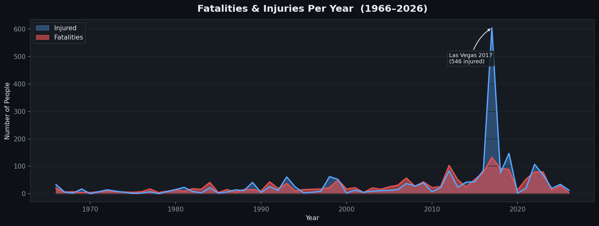

Fig 2b: จำนวนผู้เสียชีวิตและบาดเจ็บรายปี (ไม่รวมเหตุการณ์สังหารหมู่ในลาสเวกัส ปี 2017)

**ทำไมปี 2017 ถึงพุ่งสูงขนาดนั้น?**

โดยยอดรวมเหยื่อในปี 2017 มีทั้งสิ้น 737 (เสียชีวิต 132 ราย และบาดเจ็บ 605 ราย) ซึ่งเกิดจากเหตุการณ์สังหารหมู่บนถนนลาสเวกัสสตริปในวันที่ 1 ตุลาคม 2017 จากมือปืนเพียงคนเดียวยิงจากหน้าต่างโรงแรมใส่ฝูงชนกว่า 22,000 คน ซึ่งเหตุการณ์นี้เพียงเหตุการณ์เดียว ทำให้มีผู้เสียชีวิต 60 ราย และบาดเจ็บ 546 ราย รวมเหยื่อทั้งสิ้น 606 ราย (รูป Fig 2a)

หากไม่รวมเหตุการณ์นี้จำนวนเหยื่อในปี 2017 จะลดลงจาก 737 ราย เหลือเพียง 131 ราย (Fig 2b) จะเห็นว่าแนวโน้มมีการเพิ่มขึ้นอย่างต่อเนื่องทั้งของผู้เสียชีวิตและบาดเจ็บ
สรุปได้ว่าปี 2017 แนวโน้มหลักยังไปในทิศทางเดียวกัน (ความรุนแรงเพิ่มขึ้นอย่างต่อเนื่อง) แตกต่างกันที่ขนาดของเหตุการณ์) 

- 📅 **ปีที่มีเหตุการณ์มากที่สุด: 2018** — 15 เหตุการณ์
- 💀 **ปีที่มีผู้เสียชีวิตมากที่สุด: 2017** — 132 ราย
- 🔺 อัตราเพิ่มจาก **2.7 ครั้ง/ปี** (ก่อนปี 2010) เป็น **8.4 ครั้ง/ปี** (หลังปี 2010)

---

## 🏆 10 เหตุการณ์ที่มีเหยื่อมากที่สุด

Fig 3: 10 เหตุการณ์ที่มีเหยื่อรวมสูงสุด — เฉลี่ย 26 คนเสียชีวิต และ 87 คนบาดเจ็บต่อเหตุการณ์ ลาสเวกัส 2017 มีเหยื่อมากกว่าทุกเหตุการณ์ด้วยจำนวน 606 คน

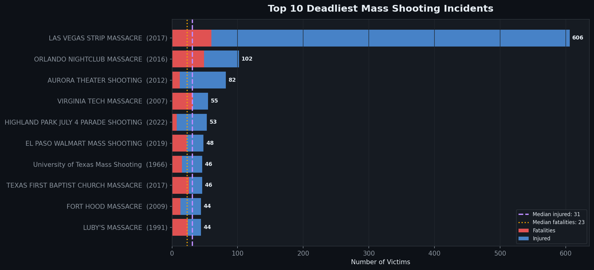

**ทำไมเหตุการณ์เหล่านี้ถึงมีผู้เสียชีวิตมากกว่า?**

จากการวิเคราะห์พบว่า เหตุการณ์ความรุนแรงที่มีผู้เสียชีวิตสูงสุด 10 อันดับแรก มีจุดร่วมสำคัญที่เหมือนกันอย่างเห็นได้ชัด ได้แก่:
- **ลักษณะสถานที่:** มักเกิดขึ้นในพื้นที่เปิดโล่งหรือสถานที่ที่มีฝูงชนแออัด (เช่น คอนเสิร์ต, ไนต์คลับ หรือขบวนพาเหรด)
- **ประเภทอาวุธ:** มีการใช้ปืนไรเฟิลกึ่งอัตโนมัติ พร้อมแมกกาซีนที่มีความจุสูง
- **การเตรียมการ:** ในหลายกรณีพบว่า มีการวางแผนเชิงยุทธวิธีมาเป็นอย่างดี

เมื่อพิจารณาจากสถิติ **จำนวนผู้เสียชีวิตเฉลี่ยใน 10 อันดับแรกพุ่งสูงถึง 26 ราย** ซึ่งมากกว่าค่าเฉลี่ยของเหตุการณ์ทั้งหมดในชุดข้อมูล (เฉลี่ย 6 ราย) ถึง **4 เท่า**
ตัวแปรสำคัญที่อธิบายความแตกต่างนี้ได้ชัดเจนที่สุดคือ **"ประเภทของอาวุธ"** โดยเหตุการณ์ที่มีการใช้ปืนไรเฟิลจะส่งผลให้มีเหยื่อจำนวนมากกว่า เนื่องจากประสิทธิภาพของตัวปืนที่มีอัตราการยิงที่เร็วและต่อเนื่อง รวมถึงความจุของกระสุนที่เอื้อต่อการสร้างความสูญเสียในวงกว้าง

| อันดับ | เหตุการณ์ | ปี | เสียชีวิต | บาดเจ็บ | รวม |
|--------|-----------|-----|-----------|---------|-----|
| 1 | LAS VEGAS STRIP MASSACRE | 2017 | 60 | 546 | **606** |
| 2 | ORLANDO NIGHTCLUB MASSACRE | 2016 | 49 | 53 | **102** |
| 3 | AURORA THEATER SHOOTING | 2012 | 12 | 70 | **82** |
| 4 | VIRGINIA TECH SHOOTING | 2007 | 32 | 23 | **55** |
| 5 | HIGHLAND PARK PARADE SHOOTING | 2022 | 7 | 46 | **53** |

> **ค่าเฉลี่ยใน 10 อันดับแรก:** ~26 คนเสียชีวิต · ~87 คนบาดเจ็บ · ~113 เหยื่อรวมต่อเหตุการณ์

---

## 🗺️ สถานการณ์กราดยิงในเเต่ละรัฐ

Fig 4: แคลิฟอร์เนียเป็นรัฐที่มีจำนวนการเกิดเหตุการณ์กราดยิงสูงที่สุด (37) ตามด้วยเท็กซัส (25) และฟลอริดา (16)

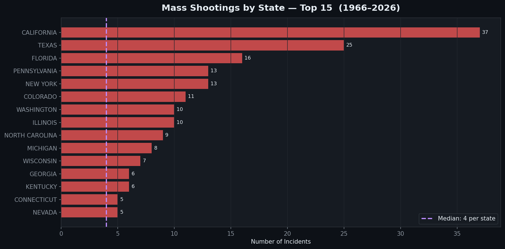

**ทำไมแคลิฟอร์เนีย เท็กซัส และฟลอริดาถึงมีมากที่สุด?**

เหตุผลอย่างหนึ่งที่สอดคล้องกับผลลัพธ์ข้างต้นคือ **ขนาดประชากร** — ทั้งสามนี้เป็นรัฐที่มีประชากรมากที่สุดในสหรัฐอเมริกา ข้อมูลในปี 2024 บ่งบอกว่า แคลิฟอร์เนีย เท็กซัส และฟลอริดา มีจำนวนประชากรอยู่ที่ 39.4 ล้าน, 31.3 ล้านเเละ 23.3ล้านตามลำดับ การมีประชากรรวมตัวอยู่ในพื้นที่หนึ่งจำนวนมากมีเเนวโน้มที่อาจจะเกิด ความเหลื่อมล้ำทางเศรษฐกิจ ความแออัด และความเครียด

| รัฐ | เหตุการณ์ | ผู้เสียชีวิต |
|-----|-----------|-------------|
| **แคลิฟอร์เนีย** | 37 | 232 |
| **เท็กซัส** | 25 | 228 |
| **ฟลอริดา** | 16 | 142 |
| นิวยอร์ก | 13 | 76 |
| เพนซิลเวเนีย | 13 | 64 |

---

## 📍 สถานที่ที่เกิดเหตุกราดยิงบ่อยครั้ง

Fig 5: สถานที่ทำงานเป็นจุดที่พบบ่อยที่สุด (57) รองลงมาคือโรงเรียน (31)

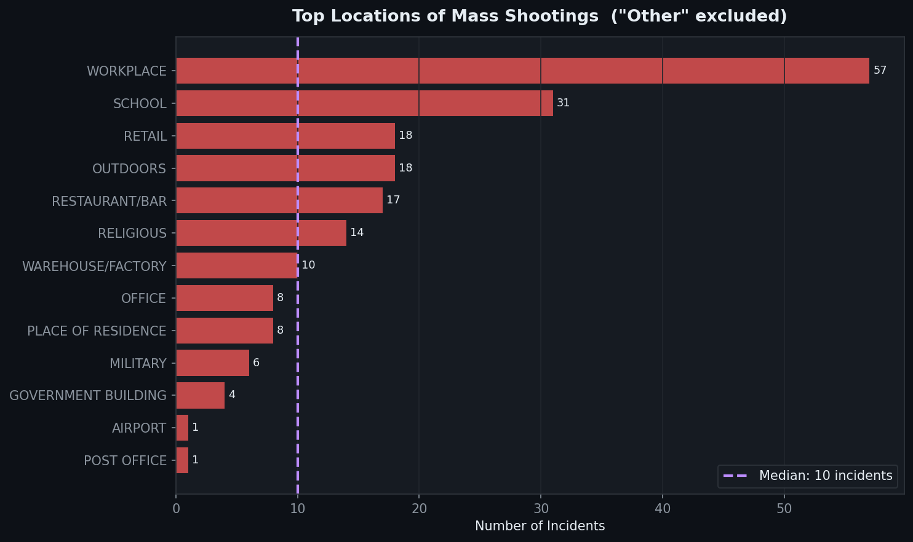

**ทำไมสถานที่ทำงานและโรงเรียนถึงเป็นเป้าหมายบ่อยที่สุด?**

เหตุผลที่ **สถานที่ทำงาน** เป็นจุดที่พบว่ามีเหตุการณ์กราดยิงเกิดขึ้นบ่อยครั้งซึ่งอาจเป็นเพราะ ที่ทำงานเป็นจุดที่รวม ความขัดแย้งระหว่างบุคคล ความเครียดทางการเงิน ความคับแค้นจากการถูกเลิกจ้างหรือลดตำแหน่ง รวมถึงผู้ก่อเหตุมีความคุ้นเคยกับสถานที่เป็นอย่างดี อันดับที่รองลงมาคือ **โรงเรียน** เเต่อาจจะมีเหตุผลที่เเตกต่างจากสถานที่ทำงาน คือ — โรงเรียนถูกมองว่าเป็น **เป้าหมายที่อ่อนแอ** ที่มีตารางเวลาที่คาดเดาได้และการรักษาความปลอดภัยที่ไม่สูงนัก นอกจากนี้อาจจะเป็นไปได้ว่าข่าวการกราดยิงในโรงเรียนได้รับความสนใจจากสื่อค่อนข้างมาก ซึ่งอาจจะเชื่อมโยงไปสู่พฤติกรรมเลียนแบบ จุดที่น่าสังเกตคือแม้ว่าโรงเรียนจะอยู่อันดับ 2 ในแง่ *ความถี่* แต่มีอัตราผู้เสียชีวิตเฉลี่ยต่อเหตุการณ์สูงกว่าสถานที่ทำงาน (9.1 คน/เหตุการณ์ เทียบกับ 6.0 คนสำหรับสถานที่ทำงาน)

| ประเภทสถานที่ | เหตุการณ์ | ผู้เสียชีวิตเฉลี่ย |
|--------------|-----------|------------------|
| **สถานที่ทำงาน** | 57 | 6.0 |
| **โรงเรียน** | 31 | 9.1 |

---

## 🔫 โปรไฟล์ของผู้ก่อเหตุ

Fig 6: 97.6% ของผู้ก่อเหตุเป็นเพศชาย (248 ราย) เเละ ผู้ก่อเหตุผิวขาวคิดเป็น 53.5% ของเหตุการณ์ทั้งหมด

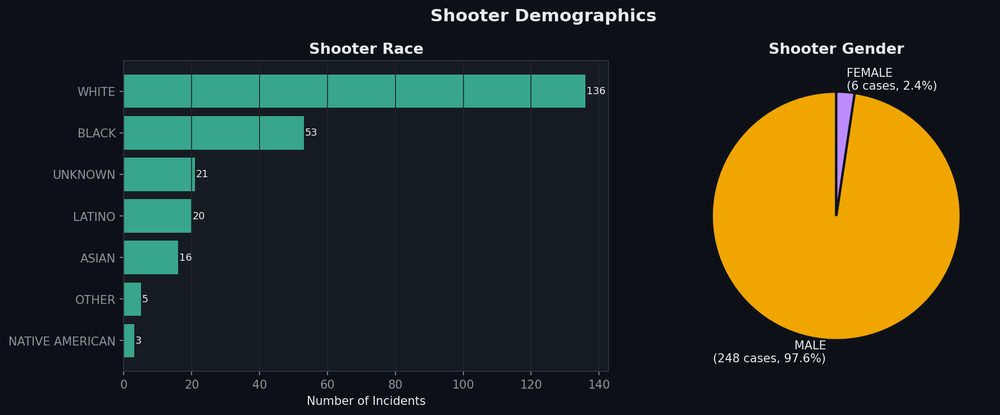

**ทำไมผู้ก่อเหตุเกือบทั้งหมดถึงเป็นเพศชาย?**

คำอธิบายหลักในเรื่องนี้อาจจะอยู่ที่ **ความเป็นชายที่ถูกสังคมกำหนด** — เมื่อผู้ชายประสบกับความอัปยศ การถูกปฏิเสธ หรือความล้มเหลว การกราดยิงอาจจะกลายเป็นการกระทำหนึ่งที่ทำให้ผู้ก่อเหตุรู้สึกว่าได้กู้คืนอำนาจกลับคืนมา ผู้ก่อเหตุเพศหญิงพบได้น้อยมาก (6 ราย, 2.4%) โดยส่วนใหญ่มักจะเกี่ยวข้องกับปัญหาภายในครอบครัว

Fig 7: อายุของผู้ก่อเหตุอยู่ระหว่าง 11–72 ปี โดยมีค่าเฉลี่ยอยู่ที่ 33 ปี เเละมีผู้ก่อเหตุที่มีอายุต่ำกว่า 18 ปีมากถึง 11 ราย (4.3%) — ทุกรายเกิดขึ้นในโรงเรียน

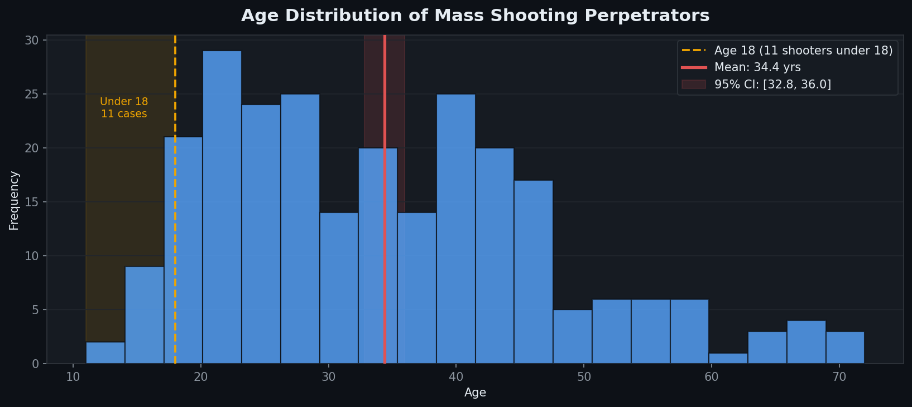

**ทำไมกลุ่มอายุต่ำกว่า 18 ปีจึงมีความสำคัญ?**

อีกจุดหนึ่งที่ค่อนข้างน่าตกใจคือ มีผู้ก่อเหตุมากถึง 11 รายที่ยังเป็นผู้เยาว์ ซึ่งทุกคนก่อเหตุ **ในโรงเรียน** ทั้งหมด โดยมีจำนวนผู้เสียชีวิตเฉลี่ยอยู่ที่ **6.4 รายต่อเหตุการณ์** ซึ่งใกล้เคียงกับค่าเฉลี่ยของชุดข้อมูลทั้งหมด (6.61) หมายความว่าผู้ก่อเหตุที่เป็นเยาวชนไม่ได้อันตรายน้อยกว่ากลุ่มช่วงอายุอื่นๆ ข้อมูลนี้จึงชี้ให้เห็นว่า **การแทรกแซงตั้งแต่เนิ่นๆ** อาจสามารถยับยั้งเหตุการณ์บางส่วนได้

---

## 🔧 อาวุธที่ใช้

Fig 8: ปืนพกเป็นอาวุธที่ใช้บ่อยที่สุด (210 เหตุการณ์) รองลงมาคือปืนไรเฟิล (149) เเละผู้ก่อเหตุส่วนใหญ่มักใช้อาวุธมากกว่าหนึ่งประเภท

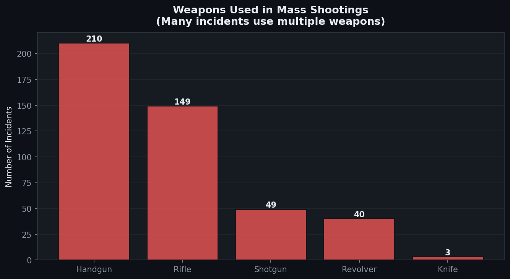

**ทำไมปืนพกถึงเป็นอาวุธที่พบบ่อยที่สุด?**
ปืนพกเป็นอาวุธปืนที่ **หาได้ง่ายและซุกซ่อนได้มากที่สุด** สามารถซื้อได้อย่างถูกกฎหมายในรัฐส่วนใหญ่ ส่วนเหตุผลที่ปืนไรเฟิลเป็นอันดับที่รองลงมาน่าจะมาจาก **ประสิทธิภาพเเละพลังทำลาย** โดยเหตุการณ์ที่มีการใช้ปืนไรเฟิลมีจำนวนเหยื่อเฉลี่ยมากกว่าถึง **4 เท่า** เมื่อเทียบกับเหตุการณ์ที่ใช้ปืนพกเพียงอย่างเดียวเท่านั้น

Fig 9: 63.4% ของผู้ก่อเหตุ (161 ราย) ได้อาวุธมาผ่านช่องทางที่ถูกกฎหมาย

  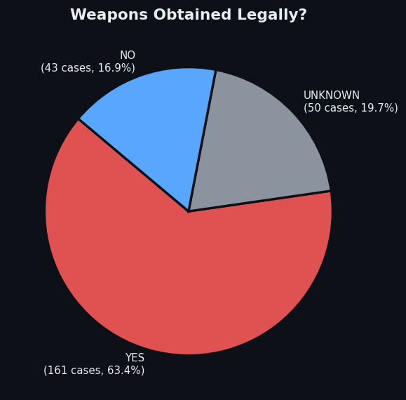

**ทำไมผู้ก่อเหตุส่วนใหญ่ล้วนครอบครองปืนอย่างถูกกฎหมาย?**

ในความเป็นจริงผู้ก่อเหตุส่วนใหญ่ซื้ออาวุธอย่างถูกต้อง — หมายความว่าพวกเขา **ผ่านการตรวจสอบประวัติ** ซึ่งชี้ให้เห็นถึงช่องว่างในระบบคัดกรองที่มีอยู่: ระบบตรวจสอบประวัติไม่ครอบคลุมบันทึกสุขภาพจิตส่วนใหญ่ รวมถึงไม่มีระยะเวลารอในหลายรัฐ

| อาวุธ | จำนวนเหตุการณ์ |
|-------|--------------|
| **ปืนพก** | 210 |
| **ปืนไรเฟิล** | 149 |
| **ปืนลูกซอง** | 49 |
| **ปืนรีวอลเวอร์** | 40 |
| **มีด** | 3 |

---

## 🧠 แรงจูงใจ

Fig 10: ความคับแค้นในที่ทำงาน/การเงิน และความขัดแย้งในครอบครัวเป็นแรงจูงใจหลักสองอย่างที่ระบุได้ชัดเจนที่สุด ไม่รวมหมวด "อื่นๆ/ไม่ระบุ" เพื่อความชัดเจน

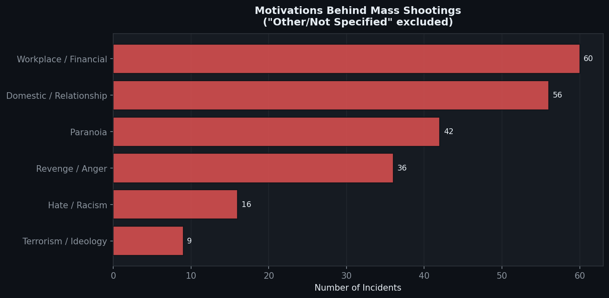

**ทำไมแรงจูงใจจากที่ทำงานและครอบครัวถึงพบบ่อยที่สุด?**

สองหมวดนี้มีเส้นร่วมกัน — **ความคับแค้นส่วนตัวต่อคนที่ผู้ก่อเหตุรู้จัก** การกราดยิงในที่ทำงานมักถูกกระตุ้นโดยการถูกเลิกจ้าง ลดตำแหน่ง หรือความอับอาย การกราดยิงในครอบครัวมักยกระดับมาจากความรุนแรงในคู่รักหรือข้อพิพาทสิทธิ์การดูแลบุตร ทั้งสองรวมกันคิดเป็น **116 เหตุการณ์ (45.7%)** ของทุกกรณีที่ทราบแรงจูงใจ สะท้อนว่าการกราดยิงส่วนใหญ่ไม่ได้มีแรงจูงใจเชิงอุดมการณ์ — แต่เป็นจุดสิ้นสุดของวิกฤตส่วนตัวที่ไม่ได้รับการแก้ไข

Fig 11: 69.7% ของผู้ก่อเหตุ (177 ราย) แสดงสัญญาณปัญหาสุขภาพจิตก่อนเกิดเหตุการณ์

  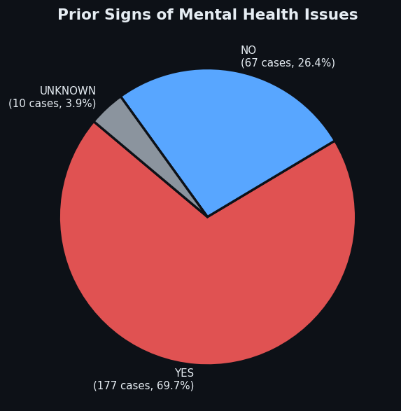

**"สัญญาณก่อนเกิดเหตุ" หมายความว่าอะไร?**

สิ่งสำคัญที่ต้องตระหนักคือ **ความเจ็บป่วยทางจิตไม่ได้ทำให้เกิดความรุนแรง** — คนส่วนใหญ่ที่มีปัญหาสุขภาพจิตไม่เคยทำร้ายใคร สิ่งที่ข้อมูลนี้แสดงให้เห็นคือในเกือบ 70% ของกรณี มี **สัญญาณเตือนที่สังเกตได้** ก่อนการโจมตี: ประวัติทางจิตเวชที่บันทึกไว้ การเข้ารับการรักษาในโรงพยาบาลก่อนหน้า การคุกคามผู้อื่น หรือพฤติกรรมที่น่าเป็นห่วงที่รายงานต่อโรงเรียนหรือตำรวจ นี่คือข้อค้นพบเกี่ยวกับ **โอกาสการแทรกแซงที่พลาดไป** ไม่ใช่เกี่ยวกับความอันตรายของผู้ป่วยโรคจิต

| แรงจูงใจ | จำนวนเหตุการณ์ |
|---------|--------------|
| **ที่ทำงาน/การเงิน** | 60 |
| **ครอบครัว/ความสัมพันธ์** | 56 |
| **ความหวาดระแวง** | 42 |
| **การแก้แค้น/ความโกรธ** | 36 |
| **ความเกลียดชัง/เหยียดผิว** | 16 |
| **การก่อการร้าย/อุดมการณ์** | 9 |

---

## 💡 ข้อเสนอแนะเชิงนโยบายจากผลการวิเคราะห์

จากรูปแบบที่พบในชุดข้อมูลนี้ พื้นที่ต่อไปนี้โดดเด่นว่าเป็นจุดแทรกแซงที่มีหลักฐานสนับสนุนมากที่สุด:

**1. ระบบเตือนภัยล่วงหน้า**
69.7% ของผู้ก่อเหตุแสดงสัญญาณเตือนสุขภาพจิตล่วงหน้า เสนอให้จัดตั้ง "โปรโตคอลการประเมินภัยคุกคามที่มีโครงสร้าง" (Structured Threat Assessment) ในสถานศึกษาและองค์กร เพื่อเปลี่ยนสถานะจาก "ผู้ถูกเฝ้าระวัง" ให้เป็น "ผู้ได้รับความช่วยเหลือ" ก่อนที่วิกฤตส่วนบุคคลจะลุกลาม โดยเฉพาะในกลุ่มเยาวชนที่ข้อมูลชี้ชัดว่ามีการปฏิสัมพันธ์กับทางโรงเรียนอยู่ก่อนแล้ว

**2. การปฏิรูประบบตรวจสอบประวัติ**
63.4% ของผู้ก่อเหตุได้อาวุธมาอย่างถูกกฎหมาย การเสริมความแข็งแกร่งของระบบตรวจสอบประวัติให้ครอบคลุมบันทึกสุขภาพจิต การเพิ่ม **การตรวจสอบประวัติสากล** สำหรับการขายระหว่างเอกชน และการนำ **ระยะเวลารอ** มาใช้ เพื่อลดการเข้าถึงอาวุธของบุคคลที่กำลังเผชิญวิกฤตเฉียบพลัน ข้อมูลไม่สนับสนุนข้ออ้างว่าการจัดหาอาวุธผิดกฎหมายเป็นช่องทางหลัก — การซื้ออย่างถูกต้องต่างหากที่เป็นช่องทางหลัก

**3. กฎหมาย Red Flag / ความเสี่ยงสูงสุด**
หลายรัฐควรมีคำสั่งคุ้มครองความเสี่ยงสุดขีด (ERPOs) ที่อนุญาตให้ศาลยึดอาวุธปืนชั่วคราวจากบุคคลที่แสดงสัญญาณเตือน เมื่อพิจารณาและเห็นว่าผู้ก่อเหตุส่วนใหญ่มี **สัญญาณล่วงหน้าที่บันทึกไว้** กฎหมายเหล่านี้หากบังคับใช้อย่างสม่ำเสมอถือเป็นมาตรการแทรกแซงที่มีหลักฐานรองรับโดยตรง

**4. โปรแกรมแทรกแซงในสถานที่ทำงาน**
เมื่อมีเหตุการณ์ 57 ครั้งเกิดขึ้นในที่ทำงาน **โปรแกรมช่วยเหลือพนักงาน (EAPs)** ควรมีการฝึกอบรมการลดความตึงเครียดสำหรับผู้จัดการ และมีช่องทางรายงานพฤติกรรมที่น่าเป็นห่วงแบบไม่ระบุตัวตนที่ชัดเจน ซึ่งควรเป็นมาตรการที่ไม่ต้องออกกฎหมายแต่นายจ้างสามารถนำไปใช้ได้ทันที

**5. แนวทางการรายงานข่าวของสื่อมวลชน**
งานวิจัยแสดงให้เห็นอย่างสม่ำเสมอว่ามี **ปรากฏการณ์การกราดยิง** — เหตุการณ์กราดยิงมักกระจุกตัวในช่วงเวลาหลังจากเหตุการณ์ที่ได้รับความสนใจสูง การรายงานข่าวที่รับผิดชอบซึ่งหลีกเลี่ยงการเปิดเผยชื่อผู้ก่อเหตุ การแสดงแถลงการณ์ของพวกเขา หรือการจัดอันดับเหตุการณ์ตามจำนวนผู้เสียชีวิต อาจช่วยลดปัจจัยเลียนแบบที่อธิบายบางส่วนของการเพิ่มขึ้นหลังปี 2010

> *"ข้อมูลไม่ได้ชี้ไปที่สาเหตุเดียว แต่ชี้ไปที่ระบบของความล้มเหลวที่ซ้อนทับกัน — ในด้านสุขภาพจิต การเข้าถึงอาวุธ และการแทรกแซงตั้งแต่เนิ่นๆ — ซึ่งทุกอย่างสามารถแก้ไขได้"*

---

## 📊 สรุป

| ตัวชี้วัด | ค่า |
|---------|-----|
| จำนวนเหตุการณ์ทั้งหมด | **254** |
| จำนวนผู้เสียชีวิตทั้งหมด | **1,680** |
| จำนวนผู้บาดเจ็บทั้งหมด | **2,060** |
| ช่วงปี | **1966–2026** |
| อัตราเฉลี่ยก่อนปี 2010 | **2.7 เหตุการณ์/ปี** |
| อัตราเฉลี่ยหลังปี 2010 | **8.4 เหตุการณ์/ปี** |
| ปีที่มีเหตุการณ์มากที่สุด | **15 ครั้ง (2018)** |
| ปีที่มีผู้เสียชีวิตมากที่สุด | **2017 (132 ราย)** |
| โปรไฟล์ผู้ก่อเหตุที่พบบ่อยที่สุด | **ชายผิวขาว อายุประมาณ 33 ปี** |
| ผู้ก่อเหตุอายุต่ำกว่า 18 ปี | **11 ราย (4.3%)** |
| อาวุธที่ใช้บ่อยที่สุด | **ปืนพก (210 เหตุการณ์)** |
| สถานที่เกิดเหตุบ่อยที่สุด | **สถานที่ทำงาน (57 เหตุการณ์)** |
| อาวุธที่ได้มาโดยถูกกฎหมาย | **63.4%** |
| สัญญาณปัญหาสุขภาพจิตล่วงหน้า | **69.7%** |

---

## 📂 แหล่งข้อมูล

**ชุดข้อมูลหลัก:**
- Follman, M., et al. (2024). *US Mass Shootings Database*. Mother Jones. https://www.motherjones.com/politics/2012/12/mass-shootings-mother-jones-full-data/
- Peterson, J., & Densley, J. (2024). *The Violence Project Database*. https://www.theviolenceproject.org/databases/

---
